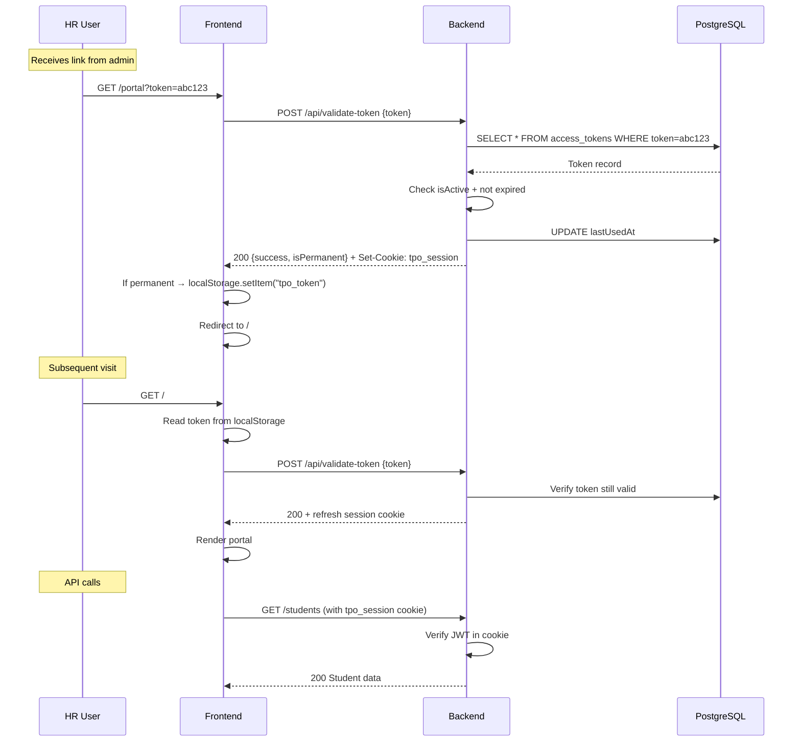

# Token-Based Access Control System for TPO Portal

## Codebase Analysis Summary

| Component | Stack | Key Details |
|-----------|-------|-------------|
| **Monorepo** | Turborepo + pnpm | Root at `tpo_college_work/` |
| **Backend** | Express 5.1 + TypeScript + Prisma 7.8 | CommonJS, deployed on Vercel serverless |
| **Frontend** | Next.js 16 + React 19 + TailwindCSS 4 | App Router, Framer Motion, Lucide icons |
| **Data Source** | Google Sheets API | Student data fetched from spreadsheets, cached in-memory |
| **Database** | PostgreSQL (via Prisma) | **Schema is empty** — no models yet, `DATABASE_URL` is blank |
| **Auth** | None | All endpoints and pages are fully public today |

### Current Frontend Routes
- `/` — Home page (program listings with student counts)
- `/branch/[branch]` — Student listing by branch
- `/about`, `/contact`, `/tp-cell`, `/googleform` — Static pages

### Current Backend Endpoints (all public)
- `GET /students`, `GET /students/:enrollment`, `GET /image/:enrollment`, `GET /students/:enrollment/certs`, `GET /batches`

---

## User Review Required

> [!IMPORTANT]
> **Database Required** — Your `.env` has `DATABASE_URL=` (empty). You'll need a PostgreSQL database for the `access_tokens` table. Options:
> - Run `npx prisma db push` after setting `DATABASE_URL` to provision the table
> - Use a free hosted Postgres (Neon, Supabase, Railway, etc.)

> [!WARNING]
> **Service Account Key Exposure** — Your `.env` file contains the full Google service account JSON key in plaintext and is committed to the repo. This is a security risk. Consider rotating this key after we add `.env` to `.gitignore`.

> [!IMPORTANT]
> **Frontend Domain for Cookies** — The httpOnly session cookie requires knowing the cookie domain. Since backend (`localhost:3001`) and frontend (`localhost:3000` / `tpoportal.vercel.app`) are on different origins, the cookie will use `SameSite=None; Secure` in production. Confirm: is your production backend on the same domain as the frontend, or a different one?

---

## Open Questions

1. **Which pages should be token-gated?** My assumption: `/` (home), `/branch/[branch]` are the "portal" pages that HR sees. The `/about`, `/contact`, `/tp-cell`, `/googleform` pages are public. Is this correct?

2. **Admin password** — I'll read it from `ADMIN_PASSWORD` env var. Do you want any specific default, or shall I leave it empty and require you to set it?

3. **Session secret** — I'll use a `SESSION_SECRET` env var for signing JWTs in the session cookie. I'll generate a random default for dev.

---

## Proposed Changes

### 1. Database Schema (Prisma)

#### [MODIFY] [schema.prisma](file:///Users/shubhashishchakraborty/shubhworkspace/tpo_college_work/apps/backend/prisma/schema.prisma)

Add the `AccessToken` model:

```prisma
model AccessToken {
  id          String    @id @default(cuid())
  token       String    @unique @db.VarChar(36)
  label       String    @db.VarChar(255)
  expiresAt   DateTime? @map("expires_at")
  isActive    Boolean   @default(true) @map("is_active")
  createdAt   DateTime  @default(now()) @map("created_at")
  lastUsedAt  DateTime? @map("last_used_at")

  @@map("access_tokens")
}
```

---

### 2. Backend — New Dependencies

#### [MODIFY] [package.json](file:///Users/shubhashishchakraborty/shubhworkspace/tpo_college_work/apps/backend/package.json)

Add:
- `cookie-parser` — Parse cookies from requests
- `jsonwebtoken` — Sign/verify JWT for session cookies
- `@types/cookie-parser`, `@types/jsonwebtoken` — Type definitions

---

### 3. Backend — Token Validation API

#### [NEW] `src/controllers/tokenController.ts`

**`POST /api/validate-token`** — Accepts `{ token: string }`:
1. Look up token in DB: `AccessToken` where `token = input AND isActive = true`
2. Check if expired: `expiresAt !== null && expiresAt < now` → reject
3. If valid: update `lastUsedAt`, sign a JWT with `{ tokenId, label }` expiring in 4 hours, set as `httpOnly` + `Secure` + `SameSite=None` cookie named `tpo_session`
4. Return `{ success: true, isPermanent: expiresAt === null }` (frontend needs `isPermanent` to decide localStorage caching)
5. On failure: return `401 { error: "Link expired or invalid." }`

---

### 4. Backend — Admin Panel APIs

#### [NEW] `src/controllers/adminController.ts`

| Endpoint | Method | Description |
|----------|--------|-------------|
| `/api/admin/login` | POST | Accepts `{ password }`, checks against `ADMIN_PASSWORD` env var, returns signed admin JWT cookie |
| `/api/admin/tokens` | GET | List all tokens (label, masked token, created, expiry, last used, status) |
| `/api/admin/tokens` | POST | Create token: accepts `{ label, expiry }` (1d/7d/30d/never), generates `crypto.randomUUID()`, returns created token |
| `/api/admin/tokens/:id/revoke` | POST | Sets `isActive = false` for the given token ID |

#### [NEW] `src/middleware/adminAuth.ts`

Middleware that verifies the `tpo_admin` cookie contains a valid admin JWT. Applied to all `/api/admin/*` routes except `/api/admin/login`.

---

### 5. Backend — Portal Route Protection

#### [NEW] `src/middleware/tokenAuth.ts`

Middleware for existing data routes (`/students`, `/batches`, `/image`, etc.):
1. Read `tpo_session` cookie
2. Verify JWT signature and expiry
3. If valid → `next()`
4. If invalid/missing → `401 { error: "Unauthorized" }`

#### [MODIFY] [index.ts](file:///Users/shubhashishchakraborty/shubhworkspace/tpo_college_work/apps/backend/src/index.ts)

- Add `cookie-parser` middleware
- Register new routes: `/api/validate-token`, `/api/admin/*`
- Apply `tokenAuth` middleware to existing data routes
- Add new env vars to `dotenv.config()`

#### [MODIFY] [.env.sample](file:///Users/shubhashishchakraborty/shubhworkspace/tpo_college_work/apps/backend/.env.sample)

Add:
```
ADMIN_PASSWORD=
SESSION_SECRET=
```

---

### 6. Frontend — Token Gate System

#### [NEW] `app/portal/page.tsx`

Entry point page at `/portal?token=abc123`:
1. Read `token` from URL search params
2. POST to `/api/validate-token` with the token
3. On success: if `isPermanent`, save token to `localStorage`; redirect to `/`
4. On failure: redirect to `/access-denied`

#### [NEW] `app/access-denied/page.tsx`

Styled error page showing:
> "This link has expired or is invalid. Please contact your TPO."

Premium design with proper branding, consistent with the portal's look.

#### [NEW] `lib/token.ts`

Utility functions:
- `getStoredToken()` — Read token from localStorage
- `storeToken(token)` / `clearToken()` — Manage localStorage
- `validateToken(token)` — Call backend validate endpoint

#### [NEW] `components/token-gate.tsx`

Client component that wraps protected pages:
1. On mount: check localStorage for cached token
2. If found: silently call `/api/validate-token` → if valid, show children; if invalid, clear localStorage and redirect to `/access-denied`
3. If no token in localStorage: check for `tpo_session` cookie by hitting a lightweight `/api/check-session` endpoint → if valid, show children; if invalid, redirect to `/access-denied`
4. Shows a loading spinner during validation

#### [MODIFY] [layout.tsx](file:///Users/shubhashishchakraborty/shubhworkspace/tpo_college_work/apps/frontend/app/layout.tsx)

No changes to root layout — the `TokenGate` wraps individual portal pages, NOT the entire app (admin and access-denied must remain ungated).

#### [MODIFY] [page.tsx](file:///Users/shubhashishchakraborty/shubhworkspace/tpo_college_work/apps/frontend/app/page.tsx) (Home)

Wrap with `<TokenGate>` component.

#### [MODIFY] [page.tsx](file:///Users/shubhashishchakraborty/shubhworkspace/tpo_college_work/apps/frontend/app/branch/%5Bbranch%5D/page.tsx) (Branch)

Wrap with `<TokenGate>` component.

#### [MODIFY] [api.ts](file:///Users/shubhashishchakraborty/shubhworkspace/tpo_college_work/apps/frontend/lib/api.ts)

- Add `withCredentials: true` to axios instance (needed for cross-origin cookies)
- Add `tokenAPI.validate()`, `adminAPI.login()`, `adminAPI.getTokens()`, `adminAPI.createToken()`, `adminAPI.revokeToken()` methods

---

### 7. Frontend — Admin Panel

#### [NEW] `app/admin/page.tsx`

Full admin panel page (**NOT** wrapped by TokenGate):

**Login Section:**
- Single password input + login button
- Calls `POST /api/admin/login`
- On success, stores admin session (cookie set by backend)

**Dashboard (after login):**
- **Create Token Form**: Label text input + Expiry dropdown (1 day / 7 days / 30 days / Never)
- **Tokens Table**: Columns — Label, Token (masked as `a3f9...xz`), Created, Expires, Last Used, Status badge (Active/Expired/Revoked)
- **Actions per row**: "Copy Link" button (copies `{origin}/portal?token=...`), "Revoke" button (instant, sets `isActive=false`)

Design: Premium dark admin UI with glassmorphism cards, status badges with color coding (green=Active, red=Revoked, yellow=Expired), smooth animations.

---

## Architecture Flow Diagram



---

## Verification Plan

### Automated Tests
1. `npx prisma db push` — Verify schema creates the `access_tokens` table
2. `tsc -b` — Verify backend compiles without errors
3. `npm run build` — Verify frontend builds without errors

### Manual Verification
1. **Token creation**: Login to admin, create a token with "7 days" expiry → verify it appears in the table
2. **Token validation**: Copy the generated link → open in incognito → verify portal loads
3. **Expiry rejection**: Create a token, manually set `expires_at` to past in DB → verify it's rejected
4. **Revoke flow**: Revoke a token from admin → try accessing portal with that token → verify redirect to `/access-denied`
5. **localStorage caching**: Create a "Never" expiry token → visit portal → close browser → reopen → verify instant access without re-entering token
6. **Cookie expiry**: Wait 4+ hours (or set short TTL for testing) → verify API calls fail and user is re-prompted
7. **Admin isolation**: Verify `/admin` is accessible without a portal token
